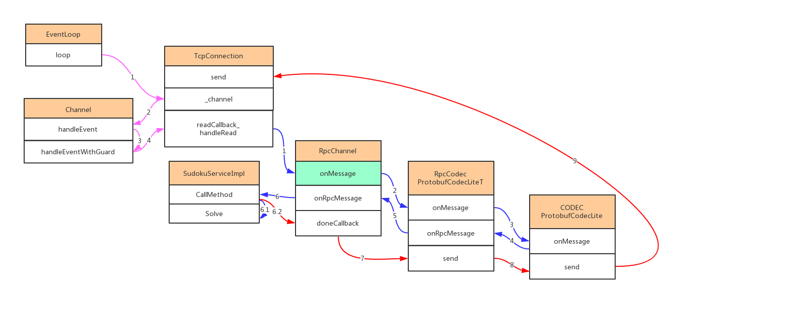

# rpcserver1

[TOC]

<br />

# 介绍
个人rpcserver尝试整理test1

<br />

# 注意
```
CreateDynamic的派生类一定要显式声明构造函数，否则不会执行注册代码。自己定义的Service和Stub都要继承自CreateService，所以也要显式声明构造函数。  
```

<br />

# 问题记录


<br />

# 待做
```
RPC超时处理,  

```


# 参考
[muduo源码分析（二）-Protobuf RPC流程](https://cloud.tencent.com/developer/article/1400801)  
[C++实现反射(根据类名动态创建对象](https://blog.csdn.net/heyuhang112/article/details/51729435)  

  
{:height=60% width=60%}  


